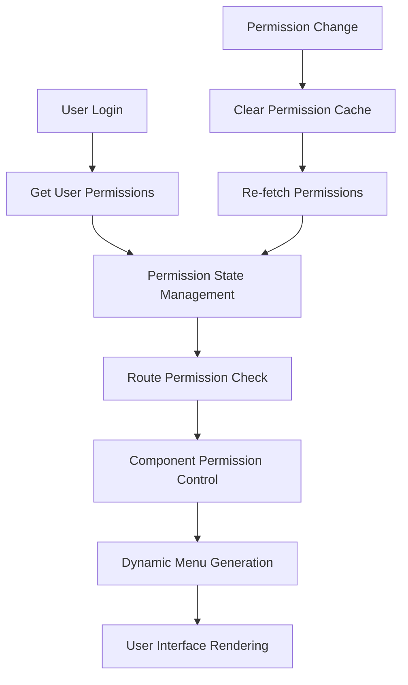

> This article explains how rustzen-admin handles frontend permissions with React Router, declarative components, permission matching, and dynamic menu generation.

## 1. System Architecture Overview

### 🔄 Complete Permission Control Flow



### 🏗️ Frontend Permission Architecture Design

```
┌─────────────────────────────────────────────────────────────┐
│                Frontend Permission System Architecture      │
├─────────────────────────────────────────────────────────────┤
│  ┌─────────────┐  ┌─────────────┐  ┌─────────────┐         │
│  │ Route Perms │  │ Component   │  │ Button      │         │
│  │ AuthGuard   │  │ AuthWrap    │  │AuthConfirm  │         │
│  └─────────────┘  └─────────────┘  └─────────────┘         │
├─────────────────────────────────────────────────────────────┤
│  ┌─────────────┐  ┌─────────────┐  ┌─────────────┐         │
│  │ State Mgmt  │  │ Permission  │  │ Dynamic     │         │
│  │useAuthStore │  │checkPermissions│ │getMenuData │         │
│  └─────────────┘  └─────────────┘  └─────────────┘         │
├─────────────────────────────────────────────────────────────┤
│  ┌─────────────┐  ┌─────────────┐  ┌─────────────┐         │
│  │ Permission  │  │ Path        │  │ Wildcard    │         │
│  │ Storage     │  │formatPathCode│ │ Support     │         │
│  └─────────────┘  └─────────────┘  └─────────────┘         │
└─────────────────────────────────────────────────────────────┘
```

---

## 2. Permission State Management Design

### 2.1 Zustand State Management Architecture

**Design Philosophy**: Centralized permission state management with persistence and real-time updates

```typescript
interface AuthState {
  userInfo: Auth.UserInfoResponse | null;
  token: string | null;
  updateUserInfo: (params: Auth.UserInfoResponse) => void;
  updateAvatar: (avatarUrl: string) => void;
  updateToken: (params: string) => void;
  setAuth: (params: Auth.LoginResponse) => void;
  clearAuth: () => void;
  checkPermissions: (code: string) => boolean;
  checkMenuPermissions: (path: string) => boolean;
}

export const useAuthStore = create<AuthState>()(
  persist(
    (set, get) => ({
      userInfo: null,
      token: null,

      // Update user information
      updateUserInfo: (params) => set({ userInfo: params }),

      // Update avatar
      updateAvatar: (avatarUrl) =>
        set((state) => ({
          userInfo: state.userInfo ? { ...state.userInfo, avatarUrl } : null,
        })),

      // Update token
      updateToken: (params) => set({ token: params }),

      // Set authentication information
      setAuth: (params) =>
        set({
          userInfo: params.user_info,
          token: params.token,
        }),

      // Clear authentication information
      clearAuth: () => set({ userInfo: null, token: null }),

      // Core permission check logic
      checkPermissions: (code: string) => {
        const permissions = get().userInfo?.permissions || [];

        // Return false if no permissions
        if (permissions.length === 0) {
          return false;
        }

        // Super admin permissions
        if (permissions.includes("*")) {
          return true;
        }

        // Exact match
        if (permissions.includes(code)) {
          return true;
        }

        // Wildcard match: system:user:* -> system:*
        const codeArr = code.split(":");
        for (let i = codeArr.length - 1; i > 0; i--) {
          const prefix = codeArr.slice(0, i).join(":") + ":*";
          if (permissions.includes(prefix)) {
            return true;
          }
        }
        return false;
      },

      // Menu permission check
      checkMenuPermissions: (path: string) => {
        const code = formatPathCode(path);
        return get().checkPermissions(code);
      },
    }),
    {
      name: "auth-store", // Persistent storage
    }
  )
);
```

### 2.2 Permission Matching Specification

**Core Points**: Support for exact matching, wildcard matching, and hierarchical permission inheritance

| User Permissions         | Check Permission     | Match Result | Description              |
| ------------------------ | -------------------- | ------------ | ------------------------ |
| `["*"]`                  | `system:user:create` | ✅           | Super administrator      |
| `["system:user:create"]` | `system:user:create` | ✅           | Exact match              |
| `["system:user:*"]`      | `system:user:create` | ✅           | Wildcard match           |
| `["system:*"]`           | `system:user:create` | ✅           | Hierarchical inheritance |
| `["system:role:*"]`      | `system:user:create` | ❌           | No match                 |

### 2.3 Path to Permission Code Conversion

**Design Highlights**: Automatically convert route paths to permission codes

```typescript
const formatPathCode = (pathname: string) => {
  const code = pathname.replace(/\//g, ":").slice(1);

  // Create page: /system/user/create -> system:user:create
  if (code.endsWith(":create")) {
    return code;
  }

  // Edit/Detail page: /system/user/123/edit -> system:user:edit
  if (code.endsWith(":edit") || code.endsWith(":detail")) {
    return code
      .split(":")
      .filter((s) => !/^\d+$/.test(s)) // Filter numeric IDs
      .join(":");
  }

  // List page: /system/user -> system:user:list
  return `${code}:list`;
};
```

**Path Conversion Examples**:

| Route Path                | Permission Code      | Description      |
| ------------------------- | -------------------- | ---------------- |
| `/system/user`            | `system:user:list`   | User list page   |
| `/system/user/create`     | `system:user:create` | Create user page |
| `/system/user/123/edit`   | `system:user:edit`   | Edit user page   |
| `/system/user/123/detail` | `system:user:detail` | User detail page |

---

## 3. Permission Component System Design

### 3.1 AuthGuard - Route Guard Component

**Design Philosophy**: Unified handling of route-level permission verification with automatic redirection

```typescript
interface AuthGuardProps {
  children: React.ReactNode;
}

export const AuthGuard: React.FC<AuthGuardProps> = ({ children }) => {
  const location = useLocation();
  const { token, updateUserInfo, checkMenuPermissions } = useAuthStore();
  const { data: userInfo } = useSWR("getUserInfo", authAPI.getUserInfo);

  // Automatically update user information
  useEffect(() => {
    if (userInfo) {
      updateUserInfo(userInfo);
    }
  }, [userInfo, updateUserInfo]);

  // Redirect to login page if not logged in
  if (!token) {
    return <Navigate to="/login" state={{ from: location }} replace />;
  }

  // Allow home page directly
  if (location.pathname === "/") {
    return children;
  }

  // Permission check
  const isPermission = checkMenuPermissions(location.pathname);
  return isPermission ? children : <Navigate to="/403" replace />;
};
```

**Usage**:

```typescript
export const router = createBrowserRouter([
  {
    path: "/",
    element: (
      <AuthGuard>
        <BasicLayout />
      </AuthGuard>
    ),
    children: [
      {
        path: "system",
        children: [
          {
            path: "user",
            element: <UserPage />,
          },
          {
            path: "role",
            element: <RolePage />,
          },
        ],
      },
    ],
  },
]);
```

### 3.2 AuthWrap - Component-level Permission Control

**Design Highlights**: Declarative permission control with support for hiding and fallback handling

```typescript
interface AuthWrapProps {
  code: string;
  children: React.ReactNode;
  hidden?: boolean;
  fallback?: React.ReactNode;
}

export const AuthWrap: React.FC<AuthWrapProps> = ({
  code,
  children,
  hidden = false,
  fallback = null,
}) => {
  const isPermission = useAuthStore.getState().checkPermissions(code);

  if (isPermission && !hidden) {
    return children;
  }

  return fallback;
};
```

**Usage Examples**:

```typescript
// Basic permission control
<AuthWrap code="system:user:create">
  <Button type="primary">Add User</Button>
</AuthWrap>

// Permission control with fallback handling
<AuthWrap
  code="system:user:edit"
  fallback={<span style={{ color: '#999' }}>No edit permission</span>}
>
  <Button>Edit User</Button>
</AuthWrap>

// Permission control with status check
<AuthWrap
  code="system:user:edit"
  hidden={record.status === 'disabled'}
>
  <Button>Edit User</Button>
</AuthWrap>
```

### 3.3 AuthConfirm - Operation-level Permission Control

**Design Philosophy**: Dangerous operations require permission confirmation for enhanced security

```typescript
interface AuthConfirmProps extends AuthWrapProps {
  title: React.ReactNode;
  description?: React.ReactNode;
  onConfirm: () => Promise<void>;
  onCancel?: () => Promise<void>;
}

export const AuthConfirm: React.FC<AuthConfirmProps> = (props) => {
  const handleConfirm = () => {
    modalApi.confirm({
      title: props.title,
      content: props.description,
      onOk: props.onConfirm,
      onCancel: props.onCancel,
    });
  };

  return (
    <AuthWrap code={props.code} hidden={props.hidden}>
      <span onClick={handleConfirm} className={props.className}>
        {props.children}
      </span>
    </AuthWrap>
  );
};
```

**Usage Example**:

```typescript
<AuthConfirm
  code="system:user:delete"
  title="Confirm Delete User"
  description="This action cannot be undone. Are you sure you want to delete this user?"
  onConfirm={handleDelete}
>
  <Button danger>Delete User</Button>
</AuthConfirm>
```

### 3.4 AuthPopconfirm - Popover Confirmation Permission Control

**Design Highlights**: Lightweight confirmation operations suitable for frequently used scenarios

```typescript
interface AuthPopconfirmProps extends AuthWrapProps {
  title: React.ReactNode;
  description?: React.ReactNode;
  onConfirm: () => Promise<void>;
  onCancel?: () => Promise<void>;
}

export const AuthPopconfirm: React.FC<AuthPopconfirmProps> = ({
  code,
  children,
  hidden = false,
  title,
  description,
  onConfirm,
  onCancel,
}) => {
  return (
    <AuthWrap code={code} hidden={hidden}>
      <Popconfirm
        placement="leftBottom"
        title={title}
        description={description}
        onConfirm={onConfirm}
        onCancel={onCancel}
      >
        {children}
      </Popconfirm>
    </AuthWrap>
  );
};
```

---

## 4. Dynamic Menu System Design

### 4.1 Menu Data Structure

**Design Philosophy**: Support for hierarchical menus and permission control

```typescript
export type AppRouter = RouteObject & {
  name?: string;
  icon?: React.ReactNode;
  children?: AppRouter[];
};
```

### 4.2 Dynamic Menu Generation

**Core Points**: Automatically generate menu structure based on user permissions

```typescript
export const getMenuData = (): AppRouter[] => {
  const { checkMenuPermissions } = useAuthStore.getState();

  const getMenuList = (menuList: AppRouter[]): AppRouter[] => {
    return menuList
      .filter((item) => {
        // Menu items without paths (like group titles) are not shown as clickable
        if (!item.path) return false;
        // Parent menus with children are displayed directly
        if (item.children) return true;
        // Check page permissions
        return checkMenuPermissions(item.path);
      })
      .map((item) => {
        return {
          ...item,
          children: item.children ? getMenuList(item.children) : undefined,
        } as AppRouter;
      })
      .filter((item) => {
        // Filter out parent menus without children
        if (item.children?.length === 0) {
          return false;
        }
        return true;
      });
  };

  return getMenuList(pageRoutes);
};
```

---

## 5. Permission Code Standards and Best Practices

### 5.1 Permission Naming Standards

**Design Principles**: Unified, clear, and extensible permission naming

```
Module:Feature:Operation
├── system:user:list     # User list
├── system:user:create   # Create user
├── system:user:edit     # Edit user
├── system:user:delete   # Delete user
├── system:role:*        # All role management permissions
└── admin:*              # All admin permissions
```

### 5.2 Component Usage Standards

| Scenario                    | Component        | Example                   | Description                                 |
| --------------------------- | ---------------- | ------------------------- | ------------------------------------------- |
| Page access control         | `AuthGuard`      | Route-level permission    | Control access to the entire page           |
| Feature module display      | `AuthWrap`       | Buttons, forms, etc.      | Control component show/hide                 |
| Dangerous operation confirm | `AuthConfirm`    | Delete, export operations | Operations requiring secondary confirmation |
| Lightweight confirmation    | `AuthPopconfirm` | Common operation confirm  | Frequently used confirmation operations     |

---

## 6. Summary

### 🎯 Multiple Benefits from Core Design

**Declarative Permission Control Design**:

- ✅ Development efficiency: Reduce repetitive code writing
- ✅ Maintainability: Permission requirements are clear at a glance
- ✅ Extensibility: Support flexible permission combinations
- ✅ User experience: Graceful degradation when no permissions

**Permission Matching Mechanism**:

- ✅ Performance optimization: Permission pre-calculation, state persistence
- ✅ Security assurance: Support for wildcards and hierarchical permissions
- ✅ Extensibility: Can be replaced with more complex permission logic

**Componentized Permission System**:

- ✅ Development efficiency: Declarative permission control
- ✅ Security: Centralized permission management
- ✅ Maintainability: Unified permission logic management
- ✅ User experience: Dynamic menus and graceful degradation

---

## 🧭 Final Thoughts

This frontend permission system is based on my real-world practice during the development of rustzen-admin, evolving from initial scattered permission checks to final declarative permission control. Through **layered permission control**, **permission matching**, and **componentized design**, we've achieved a frontend permission management solution that is both secure and user-friendly.

---

📎 **Related Resources**:

- [Backend Permission System Design](./permission-design) - Complete backend permission architecture
- [GitHub Source Code](https://github.com/idaibin/rustzen-admin/tree/main/web) - Complete frontend implementation
