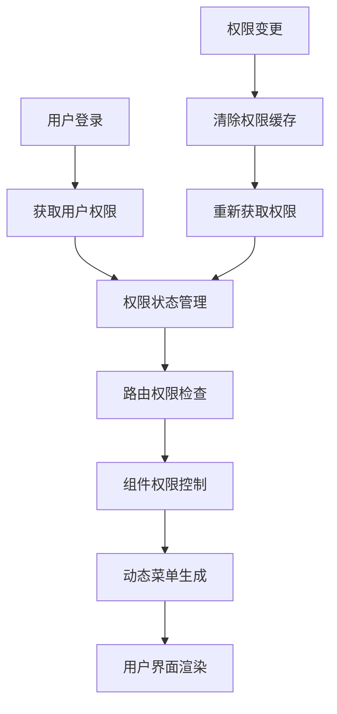

> 本文说明 rustzen-admin 如何通过 React Router、声明式组件、权限匹配和动态菜单处理前端权限。

## 一、系统架构总览

### 🔄 完整权限控制流程



### 🏗️ 前端权限架构设计

```
┌─────────────────────────────────────────────────────────────┐
│                    前端权限系统架构                           │
├─────────────────────────────────────────────────────────────┤
│  ┌─────────────┐  ┌─────────────┐  ┌─────────────┐         │
│  │  路由权限    │  │  组件权限    │  │  按钮权限    │         │
│  │ AuthGuard   │  │ AuthWrap    │  │AuthConfirm  │         │
│  └─────────────┘  └─────────────┘  └─────────────┘         │
├─────────────────────────────────────────────────────────────┤
│  ┌─────────────┐  ┌─────────────┐  ┌─────────────┐         │
│  │  状态管理    │  │  权限检查    │  │  动态菜单    │         │
│  │useAuthStore │  │checkPermissions│ │getMenuData │         │
│  └─────────────┘  └─────────────┘  └─────────────┘         │
├─────────────────────────────────────────────────────────────┤
│  ┌─────────────┐  ┌─────────────┐  ┌─────────────┐         │
│  │  权限存储    │  │  路径转换    │  │  通配符支持  │         │
│  │ permissions │  │formatPathCode│ │   wildcard  │         │
│  └─────────────┘  └─────────────┘  └─────────────┘         │
└─────────────────────────────────────────────────────────────┘
```

---

## 二、权限状态管理设计

### 2.1 Zustand 状态管理架构

**设计理念**：权限状态集中管理，支持持久化和实时更新

```typescript
interface AuthState {
  userInfo: Auth.UserInfoResponse | null;
  token: string | null;
  updateUserInfo: (params: Auth.UserInfoResponse) => void;
  updateAvatar: (avatarUrl: string) => void;
  updateToken: (params: string) => void;
  setAuth: (params: Auth.LoginResponse) => void;
  clearAuth: () => void;
  checkPermissions: (code: string) => boolean;
  checkMenuPermissions: (path: string) => boolean;
}

export const useAuthStore = create<AuthState>()(
  persist(
    (set, get) => ({
      userInfo: null,
      token: null,

      // 更新用户信息
      updateUserInfo: (params) => set({ userInfo: params }),

      // 更新头像
      updateAvatar: (avatarUrl) =>
        set((state) => ({
          userInfo: state.userInfo ? { ...state.userInfo, avatarUrl } : null,
        })),

      // 更新令牌
      updateToken: (params) => set({ token: params }),

      // 设置认证信息
      setAuth: (params) =>
        set({
          userInfo: params.user_info,
          token: params.token,
        }),

      // 清除认证信息
      clearAuth: () => set({ userInfo: null, token: null }),

      // 权限检查核心逻辑
      checkPermissions: (code: string) => {
        const permissions = get().userInfo?.permissions || [];

        // 无权限直接返回 false
        if (permissions.length === 0) {
          return false;
        }

        // 超级管理员权限
        if (permissions.includes("*")) {
          return true;
        }

        // 精确匹配
        if (permissions.includes(code)) {
          return true;
        }

        // 通配符匹配：system:user:* -> system:*
        const codeArr = code.split(":");
        for (let i = codeArr.length - 1; i > 0; i--) {
          const prefix = codeArr.slice(0, i).join(":") + ":*";
          if (permissions.includes(prefix)) {
            return true;
          }
        }
        return false;
      },

      // 菜单权限检查
      checkMenuPermissions: (path: string) => {
        const code = formatPathCode(path);
        return get().checkPermissions(code);
      },
    }),
    {
      name: "auth-store", // 持久化存储
    }
  )
);
```

### 2.2 权限匹配规范

**核心要点**：支持精确匹配、通配符匹配和层级权限继承

| 用户权限                 | 检查权限             | 匹配结果 | 说明       |
| ------------------------ | -------------------- | -------- | ---------- |
| `["*"]`                  | `system:user:create` | ✅       | 超级管理员 |
| `["system:user:create"]` | `system:user:create` | ✅       | 精确匹配   |
| `["system:user:*"]`      | `system:user:create` | ✅       | 通配符匹配 |
| `["system:*"]`           | `system:user:create` | ✅       | 层级继承   |
| `["system:role:*"]`      | `system:user:create` | ❌       | 不匹配     |

### 2.3 路径到权限代码转换

**设计亮点**：自动将路由路径转换为权限代码

```typescript
const formatPathCode = (pathname: string) => {
  const code = pathname.replace(/\//g, ":").slice(1);

  // 创建页面：/system/user/create -> system:user:create
  if (code.endsWith(":create")) {
    return code;
  }

  // 编辑/详情页面：/system/user/123/edit -> system:user:edit
  if (code.endsWith(":edit") || code.endsWith(":detail")) {
    return code
      .split(":")
      .filter((s) => !/^\d+$/.test(s)) // 过滤数字ID
      .join(":");
  }

  // 列表页面：/system/user -> system:user:list
  return `${code}:list`;
};
```

**路径转换示例**：

| 路由路径                  | 权限代码             | 说明       |
| ------------------------- | -------------------- | ---------- |
| `/system/user`            | `system:user:list`   | 用户列表页 |
| `/system/user/create`     | `system:user:create` | 创建用户页 |
| `/system/user/123/edit`   | `system:user:edit`   | 编辑用户页 |
| `/system/user/123/detail` | `system:user:detail` | 用户详情页 |

---

## 三、权限组件体系设计

### 3.1 AuthGuard - 路由守卫组件

**设计理念**：统一处理路由级权限验证，支持自动重定向

```typescript
interface AuthGuardProps {
  children: React.ReactNode;
}

export const AuthGuard: React.FC<AuthGuardProps> = ({ children }) => {
  const location = useLocation();
  const { token, updateUserInfo, checkMenuPermissions } = useAuthStore();
  const { data: userInfo } = useSWR("getUserInfo", authAPI.getUserInfo);

  // 自动更新用户信息
  useEffect(() => {
    if (userInfo) {
      updateUserInfo(userInfo);
    }
  }, [userInfo, updateUserInfo]);

  // 未登录重定向到登录页
  if (!token) {
    return <Navigate to="/login" state={{ from: location }} replace />;
  }

  // 首页直接通过
  if (location.pathname === "/") {
    return children;
  }

  // 权限检查
  const isPermission = checkMenuPermissions(location.pathname);
  return isPermission ? children : <Navigate to="/403" replace />;
};
```

**使用方式**：

```typescript
export const router = createBrowserRouter([
  {
    path: "/",
    element: (
      <AuthGuard>
        <BasicLayout />
      </AuthGuard>
    ),
    children: [
      {
        path: "system",
        children: [
          {
            path: "user",
            element: <UserPage />,
          },
          {
            path: "role",
            element: <RolePage />,
          },
        ],
      },
    ],
  },
]);
```

### 3.2 AuthWrap - 组件级权限控制

**设计亮点**：声明式权限控制，支持隐藏和降级处理

```typescript
interface AuthWrapProps {
  code: string;
  children: React.ReactNode;
  hidden?: boolean;
  fallback?: React.ReactNode;
}

export const AuthWrap: React.FC<AuthWrapProps> = ({
  code,
  children,
  hidden = false,
  fallback = null,
}) => {
  const isPermission = useAuthStore.getState().checkPermissions(code);

  if (isPermission && !hidden) {
    return children;
  }

  return fallback;
};
```

**使用示例**：

```typescript
// 基础权限控制
<AuthWrap code="system:user:create">
  <Button type="primary">新增用户</Button>
</AuthWrap>

// 带降级处理的权限控制
<AuthWrap
  code="system:user:edit"
  fallback={<span style={{ color: '#999' }}>无编辑权限</span>}
>
  <Button>编辑用户</Button>
</AuthWrap>

// 带状态判断的权限控制
<AuthWrap
  code="system:user:edit"
  hidden={record.status === 'disabled'}
>
  <Button>编辑用户</Button>
</AuthWrap>
```

### 3.3 AuthConfirm - 操作级权限控制

**设计理念**：危险操作需要权限确认，提升安全性

```typescript
interface AuthConfirmProps extends AuthWrapProps {
  title: React.ReactNode;
  description?: React.ReactNode;
  onConfirm: () => Promise<void>;
  onCancel?: () => Promise<void>;
}

export const AuthConfirm: React.FC<AuthConfirmProps> = (props) => {
  const handleConfirm = () => {
    modalApi.confirm({
      title: props.title,
      content: props.description,
      onOk: props.onConfirm,
      onCancel: props.onCancel,
    });
  };

  return (
    <AuthWrap code={props.code} hidden={props.hidden}>
      <span onClick={handleConfirm} className={props.className}>
        {props.children}
      </span>
    </AuthWrap>
  );
};
```

**使用示例**：

```typescript
<AuthConfirm
  code="system:user:delete"
  title="确认删除用户"
  description="删除后无法恢复，确定要删除这个用户吗？"
  onConfirm={handleDelete}
>
  <Button danger>删除用户</Button>
</AuthConfirm>
```

### 3.4 AuthPopconfirm - 气泡确认权限控制

**设计亮点**：轻量级确认操作，适合频繁使用的场景

```typescript
interface AuthPopconfirmProps extends AuthWrapProps {
  title: React.ReactNode;
  description?: React.ReactNode;
  onConfirm: () => Promise<void>;
  onCancel?: () => Promise<void>;
}

export const AuthPopconfirm: React.FC<AuthPopconfirmProps> = ({
  code,
  children,
  hidden = false,
  title,
  description,
  onConfirm,
  onCancel,
}) => {
  return (
    <AuthWrap code={code} hidden={hidden}>
      <Popconfirm
        placement="leftBottom"
        title={title}
        description={description}
        onConfirm={onConfirm}
        onCancel={onCancel}
      >
        {children}
      </Popconfirm>
    </AuthWrap>
  );
};
```

---

## 四、动态菜单系统设计

### 4.1 菜单数据结构

**设计理念**：支持层级菜单和权限控制

```typescript
export type AppRouter = RouteObject & {
  name?: string;
  icon?: React.ReactNode;
  children?: AppRouter[];
};
```

### 4.2 动态菜单生成

**核心要点**：根据用户权限自动生成菜单结构

```typescript
export const getMenuData = (): AppRouter[] => {
  const { checkMenuPermissions } = useAuthStore.getState();

  const getMenuList = (menuList: AppRouter[]): AppRouter[] => {
    return menuList
      .filter((item) => {
        // 没有路径的菜单项（如分组标题）直接显示
        if (!item.path) return false;
        // 有子菜单的父级菜单直接显示
        if (item.children) return true;
        // 检查页面权限
        return checkMenuPermissions(item.path);
      })
      .map((item) => {
        return {
          ...item,
          children: item.children ? getMenuList(item.children) : undefined,
        } as AppRouter;
      })
      .filter((item) => {
        // 过滤掉没有子菜单的父级菜单
        if (item.children?.length === 0) {
          return false;
        }
        return true;
      });
  };

  return getMenuList(pageRoutes);
};
```

---

## 五、权限代码规范与最佳实践

### 5.1 权限命名规范

**设计原则**：统一、清晰、可扩展的权限命名

```
模块:功能:操作
├── system:user:list     # 用户列表
├── system:user:create   # 创建用户
├── system:user:edit     # 编辑用户
├── system:user:delete   # 删除用户
├── system:role:*        # 角色管理所有权限
└── admin:*              # 管理员所有权限
```

### 5.2 组件使用规范

| 场景         | 组件             | 示例             | 说明               |
| ------------ | ---------------- | ---------------- | ------------------ |
| 页面访问控制 | `AuthGuard`      | 路由级权限验证   | 控制整个页面访问   |
| 功能模块显示 | `AuthWrap`       | 按钮、表单等组件 | 控制组件显示/隐藏  |
| 危险操作确认 | `AuthConfirm`    | 删除、导出等操作 | 需要二次确认的操作 |
| 轻量级确认   | `AuthPopconfirm` | 常用操作确认     | 频繁使用的确认操作 |

---

## 六、总结

### 🎯 核心设计带来的多重收益

**声明式权限控制设计**：

- ✅ 开发效率：减少重复代码编写
- ✅ 可维护性：权限要求一目了然
- ✅ 扩展性：支持灵活的权限组合
- ✅ 用户体验：无权限时优雅降级

**权限匹配机制**：

- ✅ 性能优化：权限预计算，状态持久化
- ✅ 安全保障：支持通配符和层级权限
- ✅ 扩展性：可替换为更复杂的权限逻辑

**组件化权限体系**：

- ✅ 开发效率：声明式权限控制
- ✅ 安全性：集中式权限管理
- ✅ 可维护性：权限逻辑统一管理
- ✅ 用户体验：动态菜单和优雅降级

---

## 🧭 写在最后

这套前端权限系统是我在开发 rustzen-admin 过程中的真实实践，从最初的分散式权限判断到最终的声明式权限控制。通过**分层权限控制**、**权限匹配**和**组件化设计**，实现了既安全又易用的前端权限管理方案。

---

📎 **相关资源**：

- [后端权限系统设计](./permission-design) - 完整的后端权限架构
- [GitHub 源码](https://github.com/rustzen/rustzen-admin/tree/main/apps/web) - 完整的前端实现
